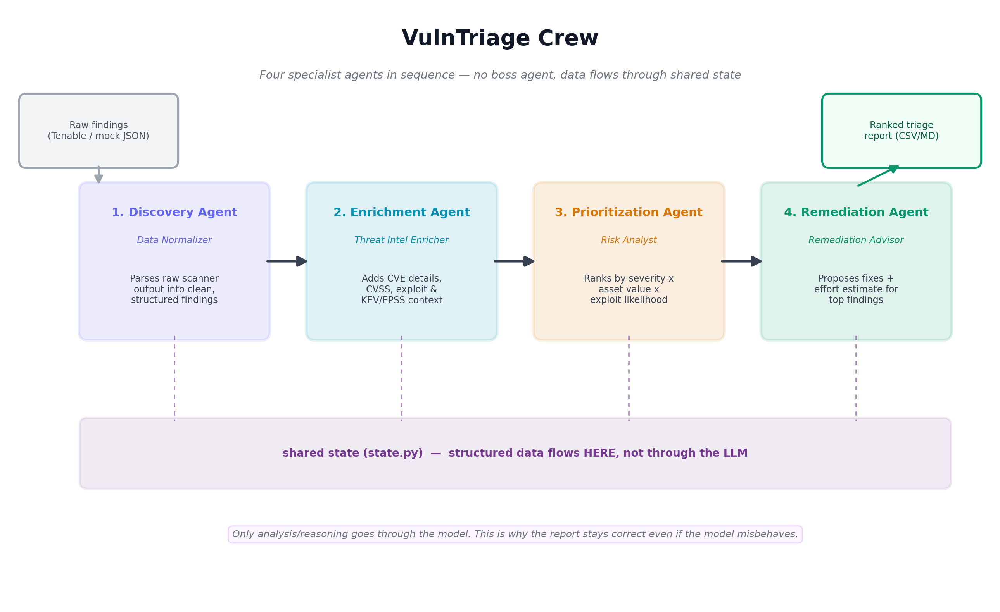

<p align="center">
  
</p>

**A CrewAI multi-agent system that takes raw vulnerability scanner output and runs
it through a triage-to-remediation workflow — discovery, enrichment,
prioritization, and remediation proposal — with each stage owned by a specialized
agent.**

The point is not that it finds vulnerabilities. Tenable already did that. The
point is that it answers the question a scanner cannot: *of these 18 findings,
which three actually matter this week, and why?*

---

## The thesis

A vulnerability scanner sorts by CVSS. CVSS describes a vulnerability *in the
abstract* — it has no idea whether it is looking at a domain controller or a lab
box that gets rebuilt every night, and no idea whether anyone is actually
exploiting the thing.

So this pipeline scores risk as:

```
risk = CVSS  ×  asset criticality  ×  exploit availability  ×  exposure
```

On the sample data, that produces a ranking that disagrees with CVSS in ways an
experienced analyst would recognize:

| | Finding | CVSS | CVSS rank | **Risk rank** |
|---|---|---:|---:|---:|
| ⬆ | **CVE-2023-44487** (HTTP/2 Rapid Reset) on `edge-web-01` | 7.5 | #15 | **#8** |
| ⬆ | **CVE-2018-15473** (OpenSSH user enum) on `edge-web-01` | 5.3 | #17 | **#14** |
| ⬇ | **CVE-2020-0796** (SMBGhost) on `branch-114-fs01` | 10.0 | #1 | **#12** |
| ⬇ | **CVE-2023-38545** (curl SOCKS5) on `test-lab-07` | 9.8 | #8 | **#15** |

A **CVSS 5.3** medium on the internet-facing storefront outranks a **CVSS 9.8**
critical on a nightly-rebuilt QA box — because the medium is reachable from the
internet with a public PoC, and the critical needs a very specific SOCKS5 proxy
configuration on a host with nothing on it.

That inversion is the whole product. Everything else is plumbing.

---

## Run it without an LLM

The data pipeline is deterministic, so you can see the whole thing work before
setting up a model:

```bash
python main.py --offline
```

## Run the actual crew (local, free)

```bash
ollama serve
ollama pull llama3.1:8b
python main.py
```

Ollama is the default backend — no API key, no bill. To use OpenAI instead:

```bash
export OPENAI_API_KEY=sk-...        # PowerShell: $env:OPENAI_API_KEY="sk-..."
python main.py --provider openai --model gpt-4o-mini
```

Both write three outputs to `output/`:

| File | For |
|---|---|
| `triage_report.md` | Reading — the narrative report |
| `triage_report.json` | Programs — full nested structure, ready to be an API response |
| `triage_report.csv` | Spreadsheets — one row per finding, 55 columns, sorts and pivots |

The CSV is the one to hand a VM lead. It opens cleanly in Excel (UTF-8 BOM), every
row is a single line, and it carries the score breakdown alongside the result — so
someone can sort by `risk_score`, filter `priority = P1`, and still see the
`asset_weight` and `exploit_weight` that produced the number.

## Which model to use

**8B parameters is the practical floor.** The agents have to call tools reliably
and then write a few hundred words of analysis, and small models struggle with
the second part in particular.

| Model | Observed on the sample findings |
|---|---|
| `llama3.1:8b` *(recommended)* | All four agents produce usable analysis. Prioritization correctly justifies all three rank inversions; remediation produces a real sequenced plan with batching and effort. Still hallucinates in places — see the narrative guard below |
| `qwen2.5:7b`, `mistral:7b` | Not tested here; expect roughly 8B-class behaviour |
| `llama3.2:3b` | Calls tools correctly — the **data is still right** — but the narrative fails: it pastes tool output back verbatim, the enrichment agent refused outright, and remediation emitted a raw tool-call blob instead of an answer |
| `gpt-4o-mini` | Not tested here; costs money, best narrative quality |

**8B is a large improvement, not a fix.** An early 8B run had the remediation
agent contradict its own schedule (a finding in Week 2 in one paragraph, Week 1
in the next), attribute a Spring4Shell finding to the wrong host, and justify the
Zerologon fix with Heartbleed's reasoning ("the keys are already gone") — the
conclusion happened to be right, the reasoning was borrowed from another CVE.

The 3B behaviour is worth understanding, because it is the reason the pipeline is
built the way it is: **the report's data was correct in every run regardless of
how badly the model narrated it.** When an agent returns a refusal or a malformed
tool call, the report says so in that agent's section instead of publishing the
artifact — see `usable_note()` in `vulntriage/report.py`. Numbers never depend on
the model.

## Running against live data

The POC ships with mock findings and a hand-curated CVE database. Both can be
swapped for live feeds without touching the agents:

```bash
python main.py --offline --live-intel          # real KEV + EPSS + NVD, mock findings
python main.py --source tenable --live-intel   # everything live
python main.py --offline                       # unchanged: pure mock, no network
```

| Flag | Effect |
|---|---|
| `--source mock` *(default)* | findings from `data/sample_findings.json` |
| `--source tenable` | findings pulled from the Tenable API |
| `--live-intel` | enrich against CISA KEV, FIRST EPSS and NVD instead of `cve_db.json` |
| `--no-cache` | bypass the on-disk intel cache and re-fetch |

### Keys

Copy `.env.example` to `.env` and fill in what you need. `.env` is gitignored;
`.env.example` documents the shape and is committed.

```
TENABLE_ACCESS_KEY=      # Settings -> My Account -> API Keys
TENABLE_SECRET_KEY=
TENABLE_FLAVOR=io        # or "sc" for Tenable.sc
# TENABLE_URL=           # override for Tenable.sc or a non-default region
NVD_API_KEY=             # free: nvd.nist.gov/developers/request-an-api-key
```

**KEV and EPSS need no key.** NVD works without one but throttles to 5 requests
per 30 seconds instead of 50 — an 18-finding cold run takes about two minutes
unkeyed and a few seconds with a key.

### What each feed contributes

| Feed | Auth | Gives | Wins on |
|---|---|---|---|
| CISA KEV | none | confirmed in-the-wild exploitation, ransomware use | exploited-or-not, in both directions |
| FIRST EPSS | none | probability of exploitation in the next 30 days | the exploit multiplier's graduated band |
| NVD | free key | description, CVSS v3.1, CWE, references | the vulnerability itself |
| Tenable | keys | the findings | what is actually on your estate |

The local database still wins on **remediation guidance** — no public feed knows
that a POS terminal cannot reboot during trading hours.

### Caching

`.cache/` (gitignored) holds the KEV catalogue, EPSS scores and NVD records. It
exists for two reasons: NVD's rate limit, and reproducibility — a report that
ranks differently because a feed refreshed mid-run is not one an analyst can
argue with. A warm run makes **zero** NVD requests and finishes in under a
second; the cold run that populated it made 17.

### When a feed is down

Intel feeds degrade: the run continues with less context and says so, on stdout
and in `pipeline_state.json`. A total outage of all three still produces a
complete, scored report from the local database.

The findings source is different. If Tenable cannot be read there is nothing to
degrade *to*, and quietly triaging the sample file instead would be a live run
that is actually a mock one — so that fails with exit 2 and an explanation.

## The narrative guard

Seven checks, each one a failure actually observed on an 8B run, each one decidable
against `PipelineState`:

| | Check | Catches |
|---|---|---|
| E1 | wrong host attribution | a CVE named alongside a host that is not its own |
| E2 | borrowed CVE reasoning | a rationale phrase tied to CVE A used for CVE B |
| E3 | schedule contradiction | one finding given two different slots |
| E4 | effort misstatement | an effort band or hour total the data disagrees with |
| E5 | unsupported extra work | "a patch is not enough" where the constraints say it is |
| E6 | fabricated finding | a CVE that is not in this run at all |
| E7 | echoed tool scaffolding | the tool's data sheet restated instead of analysed |

Violations are flagged inline in the report beside the paragraph that caused
them, recorded under `narrative_guard` in the JSON, and printed at the end of a
run. `--strict-narrative` turns them into exit code 3.

**The guard annotates; it does not silence.** These are regex heuristics over
free text, and a false positive that hides real analysis costs more than one that
adds a visible footnote. The data was never at risk either way.

A guard's PASS is worth nothing until it fails on the runs that were genuinely
wrong, so `tests/test_guard.py` holds the known-bad baseline — the real early-run
narratives, wrong host and borrowed reasoning and contradictory schedule — and
asserts every one is caught.

    python -m vulntriage.guard output/pipeline_state.json   # check a saved run

---

## How it actually works

### Mechanical work goes in tools; judgment goes in prompts

CrewAI passes one task's output to the next as *text*. That is fine for analysis
and dangerous for data — an LLM re-typing a JSON array at every hop is where these
pipelines silently lose findings, and a lost finding is one nobody ever fixes.

So this crew splits the two:

- **Structured data** moves through `vulntriage/state.py` — a shared pipeline
  state. Each stage's tool does the deterministic work (parse, join, multiply),
  writes the structured result there, and returns a compact summary.
- **Analysis** moves through the LLM. Each agent reads its tool's summary and
  does the part only it can do: notice what looks wrong, weigh trade-offs, and
  explain the result to a human.

The final report's tables and numbers are assembled from the pipeline state, so
they always reconcile with the input file. The agents' narrative is dropped in
alongside them — clearly attributed, never load-bearing for the data.

This also means `--offline` isn't a toy mode. It is the same pipeline with the
narration turned off, which makes the risk model testable in CI.

### The risk model

Defined in `vulntriage/scoring.py`, deliberately blunt and fully auditable:

| Factor | Weights |
|---|---|
| **Asset criticality** | critical ×1.50 · high ×1.25 · medium ×1.00 · low ×0.70 |
| **Exploit availability** | weaponized ×1.60 · functional ×1.45 · PoC ×1.30 · none ×1.00 |
| **Exposure** | internet-facing ×1.25 · internal ×1.00 |

CISA KEV membership floors the exploit weight at ×1.60 — CISA only lists CVEs
with confirmed in-the-wild exploitation, so it is not a signal to average away.

The product is normalized against the worst possible case (10.0 × 1.5 × 1.6 ×
1.25 = 30.0) into a 0–100 score, then banded:

| Band | Score | SLA |
|---|---|---|
| **P1** | ≥ 75 | Emergency change — 24–48 hours |
| **P2** | ≥ 55 | Expedited — 7 days |
| **P3** | ≥ 35 | Scheduled — next monthly patch cycle |
| **P4** | < 35 | Backlog — bundle with routine hardening |

Every finding carries a `ScoreBreakdown` recording each multiplier *and the
reason it was applied*, so an analyst can argue with the number instead of
guessing at it. That matters more than the weights being exactly right.

### The messy-input problem

`data/sample_findings.json` is deliberately realistic. It contains every failure
mode a real Tenable export has, and the Discovery stage handles each one:

| In the export | What Discovery does |
|---|---|
| The same SMBv1 exposure reported by two plugins | Collapses to one finding, keeps the richer evidence |
| One row carrying two CVEs | Splits into two findings, each scored on its own merits |
| A host identified only by `10.20.4.11` | Reconciled to `prod-db-01` at enrichment, via the CMDB |
| `severity` as `4` in one row and `"4"` in another | Coerced |
| PrintNightmare with a null CVSS | Filled from the intel database |
| A CVE that only appears in the plugin *name* | Recovered by regex, and flagged |
| An informational "Nessus Scan Information" row | Dropped, counted |
| A finding already marked `fixed` | Dropped, counted, and explained |

Every dropped row is accounted for in Appendix A of the report. 21 raw rows in,
18 findings out, and the difference is fully reconciled — because a triage tool
you cannot reconcile is a triage tool nobody trusts.

---

## Sample output

```
21 raw rows -> 18 findings (1 informational, 1 no-CVE, 1 already remediated,
                            1 duplicates collapsed, 1 multi-CVE rows split)
Priority: P1=4  P2=7  P3=3  P4=4

Top 5 by risk:
  1.  81.7  P1  CVE-2022-22965   edge-web-01     CVSS 9.8   [+5 vs CVSS rank #6]
  2.  80.0  P1  CVE-2020-1472    dc-01           CVSS 10.0
  3.  80.0  P1  CVE-2021-44228   prod-db-01      CVSS 10.0  [+1 vs CVSS rank #4]
  4.  78.4  P1  CVE-2019-0708    dc-01           CVSS 9.8   [+1 vs CVSS rank #5]
  5.  66.7  P2  CVE-2017-5638    hr-app-03       CVSS 10.0  [-2 vs CVSS rank #3]
```

The full report includes the ranked queue, a "why this ranking is not the CVSS
ranking" section, per-finding remediation with effort estimates and operational
constraints, suggested change-ticket batching, each agent's analysis, a
normalization audit, and an explicit list of intelligence gaps.

### The CSV export

`output/triage_report.csv` — one row per finding, in rank order:

| rank | risk_score | priority | cve | cvss | hostname | asset_criticality | effort | change_risk |
|---|---|---|---|---|---|---|---|---|
| 1 | 81.7 | P1 | CVE-2022-22965 | 9.8 | edge-web-01 | high | medium | medium |
| 2 | 80.0 | P1 | CVE-2020-1472 | 10.0 | dc-01 | critical | medium | high |
| 3 | 80.0 | P1 | CVE-2021-44228 | 10.0 | prod-db-01 | critical | medium | medium |
| … | | | | | | | | |
| 15 | 29.7 | P4 | CVE-2023-38545 | 9.8 | test-lab-07 | low | low | low |
| 18 | 19.3 | P4 | CVE-2016-2183 | 3.7 | edge-web-01 | high | low | low |

55 columns in five groups: **triage result** (rank, score, priority, SLA), **the
score breakdown** (each multiplier, the raw product, the CVSS rank it moved from),
**threat and exposure context** (KEV, exploit maturity, internet-facing,
compliance scope), **remediation** (summary, numbered steps, effort in hours,
change risk, reboot/downtime, constraints), and **provenance** (plugin id,
scanner severity, first/last seen, whether the CVE and asset were actually found
in the lookups).

Two details that matter for a file people open without thinking:

- **Every row is one line.** Multi-value fields — remediation steps, constraints,
  compliance scope — are joined with `|` rather than newlines, so a finding can
  never split into two rows.
- **Formula injection is neutralized.** Cells beginning with `=`, `+`, `-`, or `@`
  are prefixed with an apostrophe. Excel executes those otherwise, and in a real
  deployment CVE text is attacker-influenced.

---

## Project layout

```
main.py                        entry point — load, run, report
requirements.txt
README.md
FUTURE_ADDONS.md               the roadmap
PRODUCTION_GUARDRAILS.md       what production would require

docs/
  vulntriage_diagram.png       the architecture diagram above

scripts/
  lab_run.ps1                  unattended run wrapper (revives Ollama, logs)

vulntriage/
  agents.py                    the four agent definitions
  tasks.py                     one task per agent, chained
  crew.py                      orchestration (sequential)
  config.py                    LLM backend — Ollama or OpenAI
  models.py                    pydantic models, one per stage
  state.py                     shared pipeline state between stages
  normalize.py                 Discovery: raw export -> clean findings
  intel.py                     Enrichment: CVE + asset joins
  scoring.py                   Prioritization: the risk model
  remediation.py               Remediation: fixes, effort, constraints
  report.py                    markdown + JSON + CSV report builders
  guard.py                     narrative guard — the seven grounding checks
  pipeline.py                  deterministic pipeline (the --offline path)
  live/
    kev.py                     CISA KEV catalogue
    epss.py                    FIRST EPSS, batched
    nvd.py                     NVD 2.0, cached + rate-limited
    tenable.py                 Tenable pull -> raw rows for the normalizer
    cache.py                   TTL'd on-disk cache for the above
    http.py                    shared urllib fetch with retries
  tools/
    findings_loader.py         Discovery agent's tool
    cve_lookup.py              the mock CVE lookup tool
    asset_lookup.py            the mock CMDB lookup tool
    enrichment.py              Enrichment agent's batch tool
    risk_scoring.py            Prioritization + Remediation agent tools

data/
  sample_findings.json         mock Tenable export (deliberately messy)
  sample_findings.csv          same, in Tenable's CSV shape
  cve_db.json                  mock CVE intel — 17 real CVEs, NVD CVSS v3.x
  asset_inventory.json         mock CMDB — 8 assets

tests/
  test_pipeline.py             risk model + normalization tests
  test_guard.py                the guard's known-bad baseline
  test_live.py                 live clients, every external call mocked
```

---

## The four agents

| Agent | Role | Owns |
|---|---|---|
| **Discovery** | Vulnerability Data Normalizer | Parsing, dedup, splitting, filtering, and reconciling raw rows to findings |
| **Enrichment** | Threat Intelligence Enricher | CVE context, exploit reality, KEV status, asset criticality, and naming the gaps |
| **Prioritization** | Risk Prioritization Analyst | Scoring, ranking, and defending the places it disagrees with CVSS |
| **Remediation** | Remediation Advisor | Fixes, effort in hours, change batching, and the constraints that gate them |

They run sequentially, and the dependencies are real: enrichment has nothing to
enrich until discovery normalizes, and scoring is meaningless without exploit and
asset context.

---

## Scope

**In:** the four-agent crew, mock Tenable input in two formats, mock CVE and CMDB
lookups, a ranked markdown + JSON report, Ollama or OpenAI, and a deterministic
offline path.

**Out (for now):** live Tenable / NVD APIs, a UI, persistence, an interactive
approval gate, and parallel execution. All of it is in
[FUTURE_ADDONS.md](FUTURE_ADDONS.md) with the seam each one plugs into.

---

## Tests

```bash
python -m pytest tests/ -v          # or: python tests/test_pipeline.py
```

Covers normalization (dedup, multi-CVE splits, filtering, CVE recovery, host
reconciliation), the risk model's weights and bands, and — most importantly —
the CVSS-inversion cases that are the reason the project exists.

---

## The authority boundary

The crew proposes. The analyst approves. Nothing in this pipeline changes a
system, opens a ticket, or touches a host — it produces a document for a human to
read and act on.

That boundary is deliberate, and it should get *harder* to cross as the rest gets
more automated. An agent that can recommend a domain controller reboot must never
be one config flag away from performing one.

---

*POC built against mock data. The CVEs and their CVSS scores are real; the hosts,
the asset inventory, and the scan are not.*
